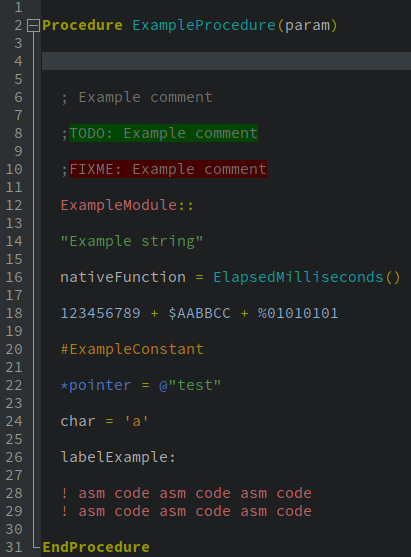

# Pleasant-Dark

https://github.com/SicroAtGit/Pleasant-Dark

> A dark, clear and pleasant color scheme for PureBasic.

## How it looks

## How to install it

Use the import function in the PureBasic IDE:

`File` > `Preferences` > `Import/Export`
